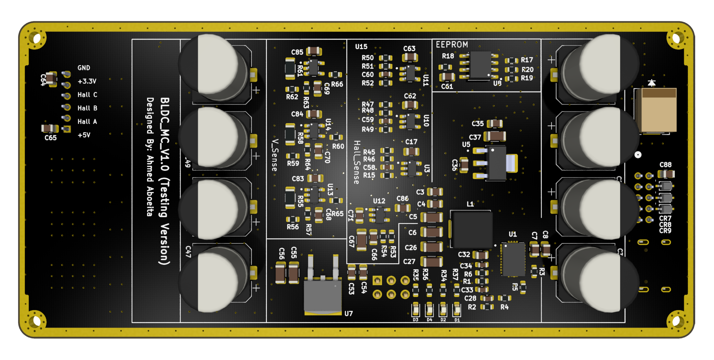

# 60V / 30A High-Performance BLDC & PMSM Motor Controller (ESC)

[-blue)](#author--project-information)

A compact, high-efficiency, 3-phase Field-Oriented Control (FOC) motor controller designed for high-power robotics, e-mobility, and industrial automation. Built on the **STM32G431RBT6** ARM Cortex-M4 MCU and the **TI DRV8353HRTAR** smart gate driver, this board supports high-frequency switching up to 100 kHz with extensive hardware protection, sensor feedback, and connectivity.

---

## Deliverables & Manufacturing Files

All production output packages have been generated and validated:

* **[Schematic PDF](Output_Job_files/Board_SCH/BLDC_MC_V1.0.pdf)** — Complete multi-sheet schematic with block hierarchy.
* **[Bill of Materials (BOM PDF)](Output_Job_files/BOM_File/BLDC_MC_V1.0_PDF.pdf)** | **[BOM CSV](Output_Job_files/BOM_File/BLDC_MC_V1.0_CSV.csv)** | **[BOM Excel](Output_Job_files/BOM_File/BLDC_MC_V1.0_Excel.xlsx)**
* **[Fabrication Gerber & Drill Files](Output_Job_files/Fabrication_Files/)** — RS-274X Gerbers and Excellon drill files for 8-layer PCB fabrication.
* **[Pick & Place Centroid Data](Output_Job_files/PnP_File/BLDC_MC_V1.0-all-pos.csv)** — Surface-mount component placement coordinates.
* **[Circuit Simulations](../Simulation/)** — LTspice simulation models for Hall sensor level shifting and BEMF voltage divider networks.

---

## Technical Specifications

| Parameter | Specification | Notes / Details |
| :--- | :--- | :--- |
| **Input DC Bus Voltage ($V_{BUS}$)** | **24V – 60V** (**60V Maximum**) | High-voltage bulk capacitor bank + TVS transient clamping |
| **Maximum Phase Current** | **30A Maximum** | Dependent on external heatsinking and thermal interface |
| **Maximum Switching Frequency** | Up to **100 kHz PWM** | Hardware-accelerated CORDIC/FMAC trigonometric engine |
| **Operating Temperature ($T_A$)** | **$-40^\circ\text{C}$ to $+125^\circ\text{C}$** | Designed for High-TG180 PCB substrates |
| **Main Processing Unit** | **STM32G431RBT6** (170 MHz) | ARM Cortex-M4 with FPU, 128KB Flash, 32KB SRAM |
| **Gate Driver IC** | **TI DRV8353HRTAR** | Smart Gate Drive ($1.4\text{A}$ source / $700\text{mA}$ sink) |
| **Power MOSFETs** | 6x **Infineon BSC027N10NS5** | 100V, $2.7\text{ m}\Omega$, SuperSO-8 (TDSON-8) |
| **Current Sense Shunts** | 3x **$1\text{ m}\Omega$ Metal Plate** | Low-side 3-shunt topology with Kelvin Sensing |
| **PCB Form Factor / Layers** | **8-Layer High-TG180 FR4** | 2 oz outer copper / 1 oz inner planes |

---

## Key Hardware Features

### 1. Processing & Control Core
* **STM32G431RBT6 MCU:** High-performance motor control MCU with integrated CORDIC co-processor for near-zero latency Park/Clarke transformations.
* **Dual Clock Source:** 24 MHz primary oscillator (`Y1`) for the main system PLL and 32.768 kHz crystal (`Y2`) for precise real-time timing.
* **Onboard Memory:** 256 Kbit SPI EEPROM (**25LC256-E/SN**) for non-volatile calibration parameters, PID coefficients, and motor profiles.

### 2. Inverter Power Stage & Gate Drive
* **Smart Gate Driver (DRV8353H):** Eliminates external gate resistors via software-tunable `IDRIVE` configuration. Features integrated $V_{DS}$ monitoring for cross-conduction and shoot-through protection.
* **Optimized Power Stage:** Low $R_{DS(on)}$ ($2.7\text{ m}\Omega$) 100V OptiMOS 5 MOSFETs paired with localized **1 nF + 4.7 $\Omega$ switch-node RC snubbers** to eliminate high-frequency parasitic ringing.
* **DC-Link Decoupling:** Low-ESR parallel ceramic capacitor bank ($4\times 47\,\mu\text{F} + 2\times 100\text{ nF}$) placed immediately across the inverter bridge for fast switching transient absorption.

### 3. Sensing & Signal Conditioning
* **3-Phase Low-Side Current Sensing:** $1\text{ m}\Omega$ shunts routed via strict 4-wire Kelvin differential pairs directly into the DRV8353 current sense amplifiers.
* **Phase Voltage / Sensorless BEMF Sensing:** Three buffered resistor divider networks ($100\text{ k}\Omega / 2.7\text{ k}\Omega$) with an active **+1.65V Virtual Ground buffer (TLV9061)** to allow full bidirectional phase voltage sampling across the MCU's ADC dynamic range.
* **Sensored Hall Interface:** Isolated Hall-effect inputs with hardware low-pass filtering and **TLV9061** op-amp buffers shifting 5V Hall signals safely to 3.125V/3.3V logic levels.

### 4. Auxiliary Power Architecture
* **Active Reverse Polarity Protection:** High-side Ideal Diode controller (**TI LM74700-Q1**) driving a power MOSFET to block reverse connection with zero diode forward-voltage drops.
* **Step-Down Buck Converter:** Converts high-voltage DC input down to an intermediate **+12V rail** for gate drive supplies.
* **Dual Linear Regulators (LDOs):**
  * **NCV4274 (5.0V):** Powers external Hall sensors and peripheral pull-ups.
  * **LDL1117S33R (3.3V):** Ultra-clean, low-noise supply for the STM32G4 MCU, analog references, and transceivers.

### 5. Robust Industrial Connectivity & Protection
* **CAN / CAN-FD Bus:** High-speed **TCAN334DR** transceiver with an **ACT1210** common-mode choke, split $60\Omega$ termination, and dedicated **PESD2CANFD24V-QCZ** ESD diode protection.
* **USB Type-C Interface:** USB 2.0 Type-C port with **USBLC6-2SC6** high-speed TVS diode array for diagnostics, firmware flashing, and PC telemetry.
* **Series Damping Resistors:** $33\,\Omega$ series termination resistors placed on all high-speed digital lines (PWM, SPI, SWD, UART, I2C) to ensure signal integrity and eliminate trace reflections.

---

## Schematic Sheet Architecture

The schematic is organized into 10 modular hierarchical sheets:

| Sheet ID | Sheet Name | Description & Subsystems |
| :---: | :--- | :--- |
| **01/10** | `BLDC_MC.kicad_sch` | Top-level hierarchical block interconnections and system bus mapping. |
| **02/10** | `BLDC_MC_V1.0_Power.kicad_sch` | LM74700 Ideal Diode, 12V Buck regulator, 5V/3.3V LDOs, status LEDs. |
| **03/10** | `BLDC_MC_V1.0_MCU.kicad_sch` | STM32G431RBT6, decoupling network, SWD debug port, USB-C interface. |
| **04/10** | `BLDC_MC_V1.0_Gate_Drive.kicad_sch` | DRV8353HRTAR smart gate driver, IDRIVE, VDS, and shunt amplifier tuning. |
| **05/10** | `BLDC_MC_V1.0_3Phase_Inverter_legs.kicad_sch` | 3-Phase MOSFET half-bridges, RC snubbers, $1\text{ m}\Omega$ current shunts. |
| **06/10** | `BLDC_MC_V1.0_HallSensor.kicad_sch` | 3-Channel Hall-effect sensor level-shifter and TLV9061 buffer circuitry. |
| **07/10** | `BLDC_MC_V1.0_Voltage_Sensor.kicad_sch` | 3-Phase BEMF divider network and +1.65V active virtual ground op-amp. |
| **08/10** | `BLDC_MC_V1.0_Memory.kicad_sch` | 25LC256 256Kbit SPI EEPROM and line termination resistors. |
| **09/10** | `BLDC_MC_V1.0_CAN_Transceiver.kicad_sch` | TCAN334DR CAN/CAN-FD transceiver, split termination, common-mode filter. |
| **10/10** | `BLDC_MC_V1.0_Connectors.kicad_sch` | High-current power pads, J8 comms header, J5 Hall header, TVS arrays. |

---

## Connector Pinout Definitions

### 1. Main Power & Motor Terminals (High Current)
* **`J6 / J9`:** DC Bus Input Power (`Vin_DC` [+] and `PGND` [-]).
* **`J1`:** Motor Phase A Output (`Phase_A`).
* **`J2`:** Motor Phase B Output (`Phase_B`).
* **`J7`:** Motor Phase C Output (`Phase_C`).

### 2. Communication Header (`J8` - 10-Pin S10B-PHDSS)
| Pin # | Net Name | Type | Description |
| :---: | :--- | :---: | :--- |
| **1** | `+3.3V` | Power | 3.3V Auxiliary Output Rail |
| **2** | `CAN_N` | Diff I/O | CAN Bus Dominant Low Line |
| **3** | `CAN_P` | Diff I/O | CAN Bus Dominant High Line |
| **4** | `I2C3_SCL` | Bidirectional | I2C Clock (STM32 Pin 40 / PC8) |
| **5** | `GND` | Ground | System Ground Return |
| **6** | `+5V` | Power | 5.0V Auxiliary Output Rail |
| **7** | `UART4_RX` | Input | UART4 Receive Line (STM32 Pin 53 / PC11) |
| **8** | `UART4_TX` | Output | UART4 Transmit Line (STM32 Pin 52 / PC10) |
| **9** | `I2C3_SDA` | Bidirectional | I2C Data (STM32 Pin 41 / PC9) |
| **10** | `GND` | Ground | System Ground Return |

### 3. Hall Sensor Header (`J5` - 6-Pin S6B-PH-K-S)
| Pin # | Net Name | Type | Description |
| :---: | :--- | :---: | :--- |
| **1** | `+5V` | Power | Hall Sensor Power Supply (5V) |
| **2** | `Hall_A` | Input | Phase A Hall Sensor Signal |
| **3** | `Hall_B` | Input | Phase B Hall Sensor Signal |
| **4** | `Hall_C` | Input | Phase C Hall Sensor Signal |
| **5** | `+3.3V` | Power | Optional 3.3V Pull-up / Supply |
| **6** | `GND` | Ground | Sensor Ground Return |

### 4. Debug & Programming (`J4` - 6-Pin SWD Header)
* **Pin 1:** `+3.3V` | **Pin 2:** `NRST` | **Pin 3:** `SWDIO` (PA13) | **Pin 4:** `SWCLK` (PA14) | **Pin 5:** `SWO` (PB3) | **Pin 6:** `GND`

---

## Recommended PCB Stackup & Layout Rules

### PCB Stackup

The board uses an 8-layer high-TG180 FR4 stackup with 1.65 mm nominal finished thickness. Copper thicknesses and dielectric spacing are nominal values from the fabrication stackup.

| Layer / Dielectric | Material | Thickness |
| :--- | :--- | :---: |
| L1 | Outer copper, 1 oz | 0.035 mm (1.38 mil) |
| L1-L2 | 2116 prepreg, RC54%, 4.9 mil | 0.094 mm (3.70 mil) |
| L2 | Inner copper | 0.030 mm (1.18 mil) |
| L2-L3 | FR4 core, 0.25 mm / 1 oz without copper | 0.250 mm (9.84 mil) |
| L3 | Inner copper | 0.030 mm (1.18 mil) |
| L3-L4 | 2116 prepreg, RC54%, 4.9 mil, 2 plies | 0.188 mm (7.40 mil) |
| L4 | Inner copper | 0.030 mm (1.18 mil) |
| L4-L5 | FR4 core, 0.25 mm / 1 oz without copper | 0.250 mm (9.84 mil) |
| L5 | Inner copper | 0.030 mm (1.18 mil) |
| L5-L6 | 2116 prepreg, RC54%, 4.9 mil, 2 plies | 0.188 mm (7.40 mil) |
| L6 | Inner copper | 0.030 mm (1.18 mil) |
| L6-L7 | FR4 core, 0.25 mm / 1 oz without copper | 0.250 mm (9.84 mil) |
| L7 | Inner copper | 0.030 mm (1.18 mil) |
| L7-L8 | 2116 prepreg, RC54%, 4.9 mil | 0.094 mm (3.70 mil) |
| L8 | Outer copper, 1 oz | 0.035 mm (1.38 mil) |

### Controlled Impedance

| Target impedance | Type | Signal layer | Reference layer | Trace width | Differential spacing |
| :---: | :--- | :---: | :---: | :---: | :---: |
| 50 ohm | Single-ended, non-coplanar | L1 | L2 | 6.790 mil (0.172 mm) | - |
| 50 ohm | Single-ended, non-coplanar | L3 | L2 / L4 | 8.370 mil (0.213 mm) | - |
| 100 ohm | Differential pair, non-coplanar | L1 | L2 | 5.270 mil (0.134 mm) | 8.000 mil (0.203 mm) |

* **Power Decoupling:** Place low-ESR ceramic caps ($47\,\mu\text{F}$) as close as physically possible to the high-side MOSFET drains and low-side source shunts.
* **Kelvin Current Sensing:** Keep `SA+`/`SA-`, `SB+`/`SB-`, and `SC+`/`SC-` routed strictly as shielded differential pairs on Layer 3, isolated from high $dv/dt$ switch-node planes.

---

## Author & Project Information
* **Lead Hardware Engineer:** Ahmed Aboeita
* **Design Suite:** KiCad E.D.A. v10.0.5
* **Design Revision:** Rev 1.0 (2026-08-17)