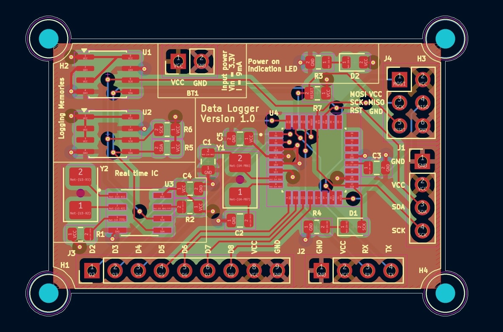
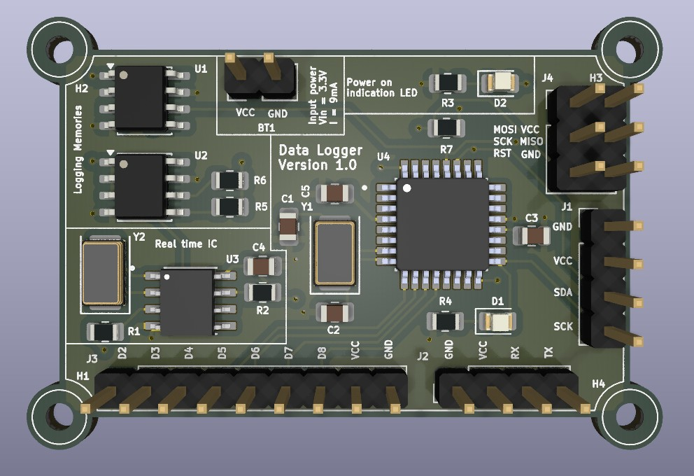

# KiCad Data Logger PCB

A custom-designed PCB created in KiCad featuring a microcontroller, Real-Time Clock (RTC), and dual EEPROM storage for high-reliability data logging.

## 📍 Overview
This project is a dedicated controller board designed to collect data via **I2C** or **UART** and store it securely across two EEPROM flash chips. The integrated RTC ensures every data point is accurately time-stamped.

## 🛠 Hardware Specifications
* **Microcontroller:** 
* **Real-Time Clock:** 
* **Storage:** 2x EEPROM Flash ICs 
* **Interfaces:** 
    * UART (for serial debugging/data input)
    * I2C (for sensor communication and internal peripherals)

## 🏗 System Architecture
The microcontroller acts as the I2C Master, coordinating data transfers between the external sensors and the internal storage components.

| Component | Bus | Function |
| :--- | :--- | :--- |
| **RTC IC** | I2C | Timekeeping & Calendar |
| **EEPROM 1** | I2C | Primary Data Storage |
| **EEPROM 2** | I2C | Backup/Redundant Storage |
| **Debug Port** | UART | CLI Interface & Data Offloading |

## 📸 Board Layout

*Figure 1: 2D Layout of the PCB showing the MCU, RTC, and Dual EEPROM placement.*

## 📸 Board 3D view

