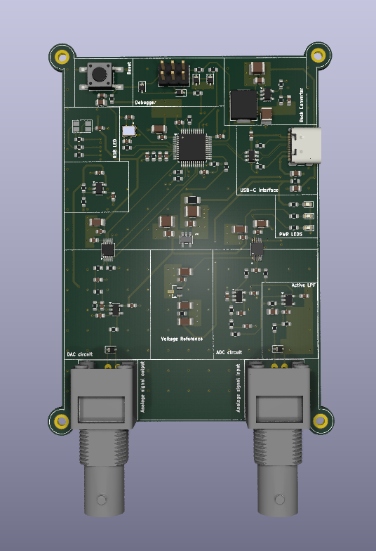
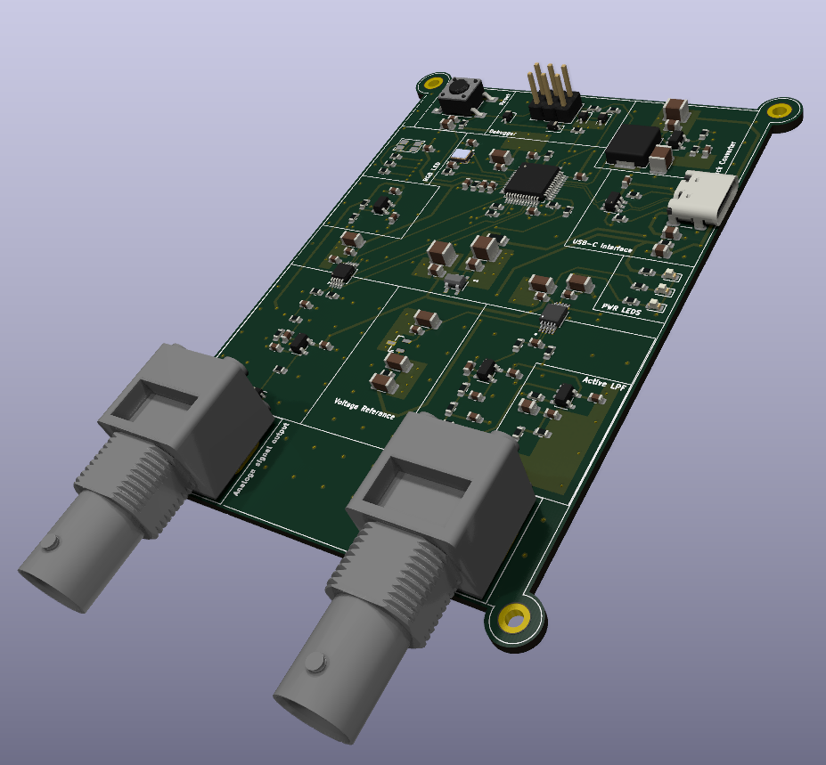
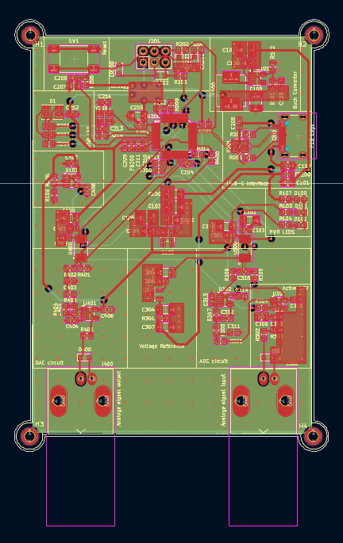

# Mixed Signal Board - FEDEVEL Course

## Description
This repository contains the hardware design files for a **Mixed Signal Board**, focused on Analog Signal Acquisition and Generation using an ADC and DAC. The board is designed as part of the FEDEVEL Academy course. 

It features an STM32 microcontroller that interfaces with high-precision Analog-to-Digital and Digital-to-Analog converters, providing an excellent platform for learning mixed-signal PCB design, signal conditioning, and low-noise routing.

## Features & Specifications

### Microcontroller
* **MCU**: STM32F103C8T6 (ARM Cortex-M3)
* **Connectivity**: USB-C connector for power and data transfer (with USBLC6-2SC6 ESD protection).
* **Debugging**: SWD (Serial Wire Debug) header for firmware upload and debugging.

### Power Supply
* **Digital Power (3.3V)**: High-efficiency buck converter (TLV62569DBVR) capable of 250mA max current for the digital circuitry.
* **Analog Power (3.3VA)**: Low Dropout Regulator (LDO - HT7533-1) with a low-pass filter to provide a clean and stable power supply for sensitive analog ICs.

### Analog-to-Digital Converter (ADC) Section
* **ADC IC**: 14-bit ADC141S626 interfaced with the MCU via SPI.
* **Analog Front-End (AFE)**: Utilizes an MCP6001 Op-Amp.
* **Filtering**: 3rd order Butterworth anti-aliasing low-pass filter with a cutoff frequency ($f_c$) of 25kHz.
* **Input**: BNC connector supporting an input voltage range of -1.65V to +1.65V.

### Digital-to-Analog Converter (DAC) Section
* **DAC IC**: Dual 16-bit DAC7563 interfaced with the MCU via SPI.
* **Output Conditioning**: Anti-aliasing filter and output buffer using an MCP6001 Op-Amp.
* **Output**: BNC connector with an output voltage range of 0V to +3.3V.

## Repository Structure
* `Board_Pics/`: Contains 3D renders and PCB layout screenshots.
* `Datasheets/`: Relevant component datasheets used in the design.
* `Fabrecation_Gerber_Files/`: Manufacturing files (Gerbers, Drill files) for PCB fabrication.
* `Simulations/`: Circuit simulation files for the analog front-end and filters.
* `Stackup/`: PCB stackup details and impedance control specifications.
* `BOM_File/`: Bill of Materials.
* `Libraries/`: Project-specific KiCad footprint and symbol libraries.
* `Mixed_Signal_Board_FEDEVEL_Course.pdf`: Complete schematic diagram in PDF format.
* `*.kicad_sch` & `*.kicad_pcb`: KiCad project source files (Schematic and PCB layout).

## Board Visuals

### 3D View

### PCB Layout

