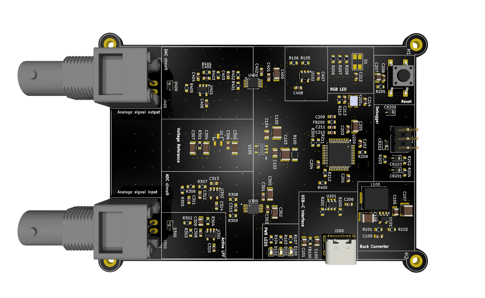

# Mixed Signal Acquisition & Generation Board

<div align="center">

[](https://www.kicad.org/)
[](https://www.st.com/)
[](#mixed-signal-pcb-layout--grounding-strategy)
[](https://www.fedevel.com/)
[](LICENSE)

<br/>

**A high-precision, 4-layer Mixed-Signal PCB designed for high-fidelity analog acquisition and precision waveform generation.**

<br/>



</div>

---

## Table of Contents
- [Overview](#overview)
- [Key Features & Hardware Specifications](#key-features--hardware-specifications)
  - [1. Microcontroller & Host Interface](#1-microcontroller--host-interface)
  - [2. Power Architecture & Low-Noise Regulation](#2-power-architecture--low-noise-regulation)
  - [3. Analog Front-End & ADC Acquisition](#3-analog-front-end--adc-acquisition)
  - [4. Precision DAC & Output Reconstruction](#4-precision-dac--output-reconstruction)
- [Mixed-Signal PCB Layout & Grounding Strategy](#mixed-signal-pcb-layout--grounding-strategy)
- [Project Directory Structure](#project-directory-structure)
- [Manufacturing & Fabrication](#manufacturing--fabrication)
- [PCB Layout Visual](#pcb-layout-visual)
- [Acknowledgments](#acknowledgments)

---

## Overview

The **Mixed Signal Board** is a professional-grade hardware design project developed as part of the **FEDEVEL Academy Advanced PCB Design Course**. 

The board demonstrates industry best practices for mixed-signal design, high-resolution data acquisition, precision signal generation, low-noise power delivery, and high-frequency noise mitigation. It interfaces an **STM32 ARM Cortex-M3 microcontroller** with isolated analog front-ends, high-speed SPI buses, and precision filtering networks.

---

## Key Features & Hardware Specifications

### 1. Microcontroller & Host Interface
| Component | Specification / Feature |
| :--- | :--- |
| **MCU** | STM32F103C8T6 (ARM Cortex-M3, 72 MHz) |
| **Interface** | Reversible USB-C for power delivery & high-speed data communications |
| **ESD Protection** | USBLC6-2SC6 low-capacitance TVS diode array protecting USB data lines |
| **Debug & Programming** | Dedicated SWD (Serial Wire Debug) header for JTAG/SWD programmers (ST-Link / J-Link) |

---

### 2. Power Architecture & Low-Noise Regulation
To prevent digital switching noise from coupling into the sensitive analog section, the power supply architecture features separate, highly-filtered digital and analog domains:

* **Digital Domain (+3.3VD)**: 
  * Powered by a **TLV62569DBVR** high-efficiency synchronous step-down buck converter (supplying up to 250mA+ with high efficiency and minimal thermal footprint).
* **Analog Domain (+3.3VA)**: 
  * Linear regulated via a **HT7533-1** ultra-low quiescent current LDO.
  * Supplemented by an LC/RC low-pass ripple suppression filter network to guarantee an ultra-quiet rail for the ADC, DAC, and operational amplifiers.

---

### 3. Analog Front-End & ADC Acquisition
* **ADC IC**: **ADC141S626** (14-Bit, 50 kSPS to 250 kSPS differential/single-ended sampling ADC via high-speed SPI).
* **Signal Conditioning**: Active Analog Front-End (AFE) based on the **MCP6001** low-noise rail-to-rail operational amplifier.
* **Anti-Aliasing Filter**: 3rd-order Butterworth active low-pass filter with a cutoff frequency ($f_c$) of **25 kHz** to reject high-frequency harmonics and out-of-band noise.
* **Input Interface**: 50 Ohm BNC connector designed for an analog input span of **-1.65V to +1.65V** with precision DC bias level-shifting to match the ADC reference.

---

### 4. Precision DAC & Output Reconstruction
* **DAC IC**: **DAC7563** (Dual-channel, 16-Bit high-accuracy voltage output DAC with internal 2.5V 4ppm/degC reference).
* **Reconstruction Filter & Output Stage**: Active low-pass filter and high-drive output buffer utilizing an **MCP6001** Op-Amp for smooth analog waveform synthesis.
* **Output Interface**: 50 Ohm BNC connector delivering an output swing of **0V to +3.3V**.

---

## Mixed-Signal PCB Layout & Grounding Strategy

* **4-Layer Controlled Impedance Stackup**:
  * **Layer 1 (Top Signal)**: High-speed SPI, analog signal routing, and active IC placement.
  * **Layer 2 (Ground Plane)**: Continuous low-impedance ground reference split into AGND and DGND with a star-ground connection.
  * **Layer 3 (Power Plane)**: Partitioned copper pours for `+3.3VD`, `+3.3VA`, and `+5V_USB`.
  * **Layer 4 (Bottom Signal)**: Non-critical low-speed routing and auxiliary grounding.
* **Noise Isolation**: Strict physical partitioning between high-speed digital switching signals and low-amplitude analog paths.

---

## Project Directory Structure

```plaintext
Mixed_Signal_Board_FEDEVEL_Course/
|-- Project_output_file/                     # Generated manufacturing & visual assets
|   |-- 3D_Pics/                             # 3D PCB photorealistic renders
|   |   `-- Mixed_Signal_Board_FEDEVEL_Course_Front.png
|   |-- Board_Pics/                          # PCB top/bottom layout screenshots
|   |   `-- layout.png
|   |-- BOM_File/                            # Bill of Materials (PDF & CSV formats)
|   |   |-- BOM_File.pdf
|   |   `-- Mixed_Signal_Board_FEDEVEL_Course.csv
|   `-- Fabrecation_Gerber_Files/            # Gerber RS-274X & Excellon drill files
|
|-- Datasheets/                              # Component technical datasheets & reference manuals
|-- Libraries/                               # Custom KiCad schematic symbols and footprints
|-- Simulations/                             # LTspice / analog filter simulation models
|   `-- analog_Supply_LBF/                   # Low-pass filter frequency response & AC analysis
|-- Stackup/                                 # Layer stackup definition & impedance calculation profile
|   `-- Impedace_Profile_Calculations.png
|
|-- Mixed_Signal_Board_FEDEVEL_Course.kicad_pcb  # KiCad PCB Layout source file
|-- Mixed_Signal_Board_FEDEVEL_Course.kicad_sch  # KiCad Master Schematic file
|-- Mixed_Signal_Board_MCU.kicad_sch             # MCU Sub-sheet
|-- Mixed_Signal_Board_Power.kicad_sch           # Power Supply Sub-sheet
|-- Mixed_Signal_Board_ADC.kicad_sch             # ADC & AFE Sub-sheet
|-- Mixed_Signal_Board_DAC.kicad_sch             # DAC & Output Buffer Sub-sheet
|-- Mixed_Signal_Board_FEDEVEL_Course.pdf        # Complete schematic export (PDF)
`-- README.md                                    # Project documentation
```

---

## Manufacturing & Fabrication

All fabrication outputs are ready for direct submission to PCB manufacturers (e.g., JLCPCB, PCBWay, Eurocircuits):
* **Gerber Files**: Located in [`Project_output_file/Fabrecation_Gerber_Files/`](Project_output_file/Fabrecation_Gerber_Files/)
* **Bill of Materials (BOM)**: Located in [`Project_output_file/BOM_File/`](Project_output_file/BOM_File/)
* **Complete Schematic (PDF)**: [`Mixed_Signal_Board_FEDEVEL_Course.pdf`](Mixed_Signal_Board_FEDEVEL_Course.pdf)

---

## PCB Layout Visual

<div align="center">
  
  <p><em>Top and Internal Layer Routing with Dedicated Analog/Digital Partitioning</em></p>
</div>

---

## Acknowledgments
* Designed following the pedagogical framework and guidelines of **[FEDEVEL Academy](https://www.fedevel.com/)**.
* Special thanks to **Philip Salmony** for invaluable insights into high-speed and mixed-signal PCB layout techniques.